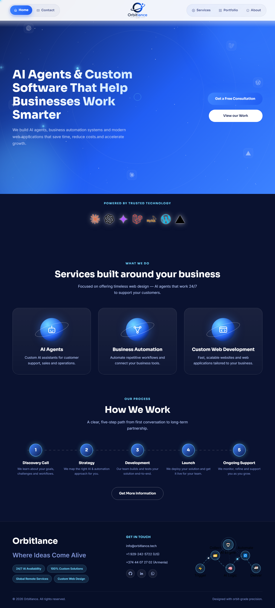

# Orbitlance

**AI Agents & Custom Software That Help Businesses Work Smarter**

Marketing website for **Orbitlance LLC**, an IT services company building AI agents, business automation, custom software, CRMs and websites for businesses that want to work smarter, not harder.

🔗 Live: [orbitlance.tech](https://orbitlance.tech)

## Why this site exists

Orbitlance's own tagline is *"Where Ideas Come Alive"* — the site was built to be the first impression a potential client gets of that promise. Instead of a generic agency template, the goal was a site that felt like the product itself: modern, AI-first, and a little bit space-themed, with a full galaxy background, an orbiting logo, and planet-style service cards that reflect the "Orbitlance" name.

Every page was shaped around one idea: businesses don't want to read about technology, they want to see how AI agents, automation and custom software actually make their day-to-day work lighter. The five pages (Home, Services, Portfolio, About, Contact) walk a visitor from *what we do*, to *proof of work*, to *who we are*, to *how to reach us* — a straightforward path that mirrors how Orbitlance actually engages new clients: discovery call → strategy → development → launch → ongoing support.

## Preview



## Color palette

| Swatch | Name | Hex | Usage |
|---|---|---|---|
|  | Navy | `#0D1B4C` | Base background, dark UI surfaces |
|  | Blue | `#215EF4` | Primary brand color, buttons, links |
|  | Blue Light | `#3D83FF` | Gradient accents, hover states |
|  | Cyan | `#6FD6FF` | Highlights, glow effects |
|  | White | `#FFFFFF` | Text on dark surfaces, cards |
|  | Muted | `#AEC0F0` | Secondary text |
|  | Muted 2 | `#7E93D4` | Tertiary text, subtle UI |

Primary gradient: `linear-gradient(135deg, #0D1B4C 0%, #215EF4 55%, #3D83FF 100%)`

## Tech stack

Plain HTML, CSS and JavaScript — no build step, no framework. A single shared `assets/css/style.css` and `assets/js/main.js` power all five pages, including the animated galaxy background, custom cursor, scroll-reveal animations and the SVG workflow diagram in the footer.

## Pages

- **Home** — hero, services overview, "How We Work" process
- **Services** — AI assistants, automation, CRM, custom software, web design, FAQ
- **Portfolio** — project showcase
- **About** — company story and values
- **Contact** — inquiry form and contact details

## Running locally

```bash
npx serve .
```
